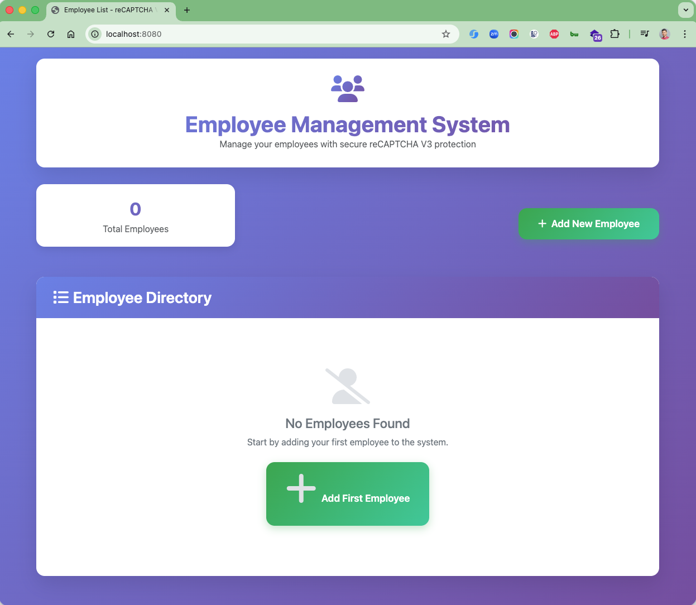
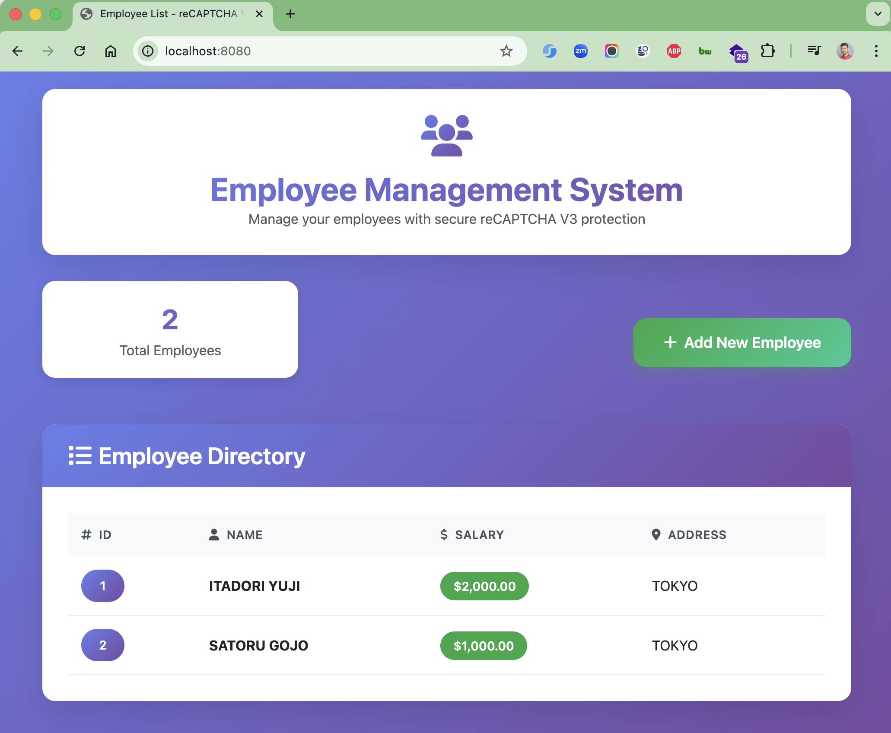
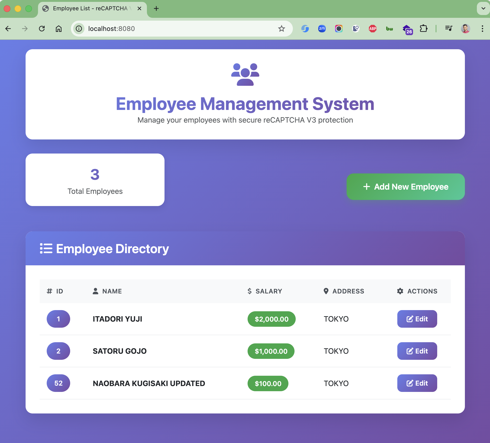
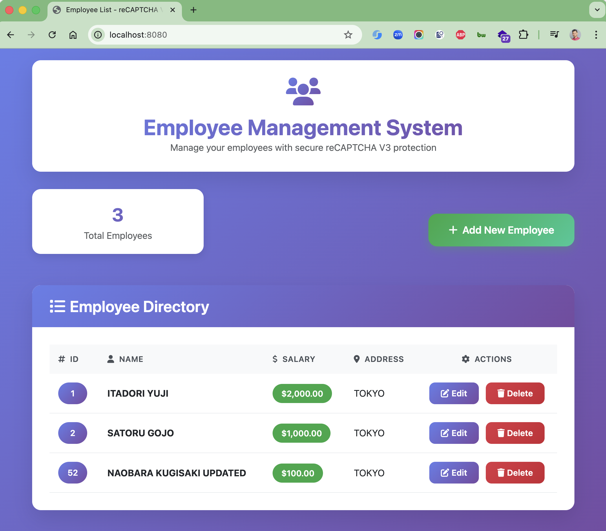
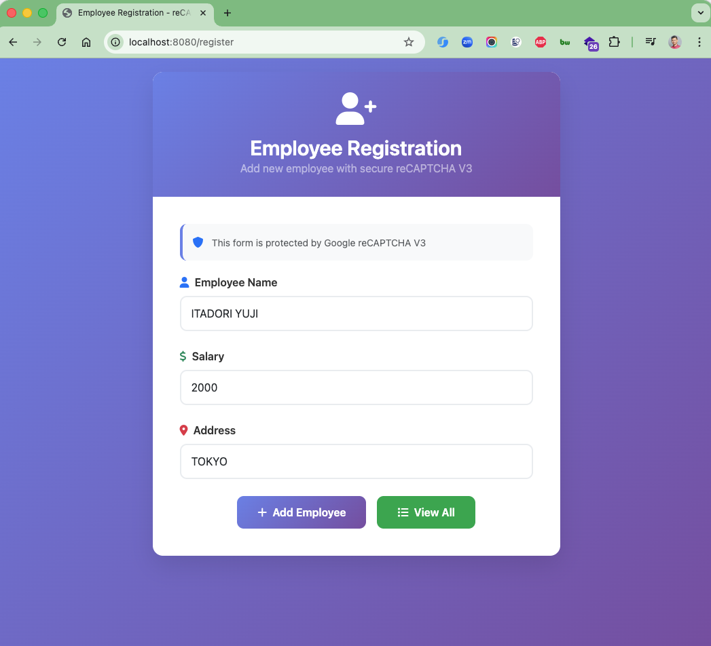
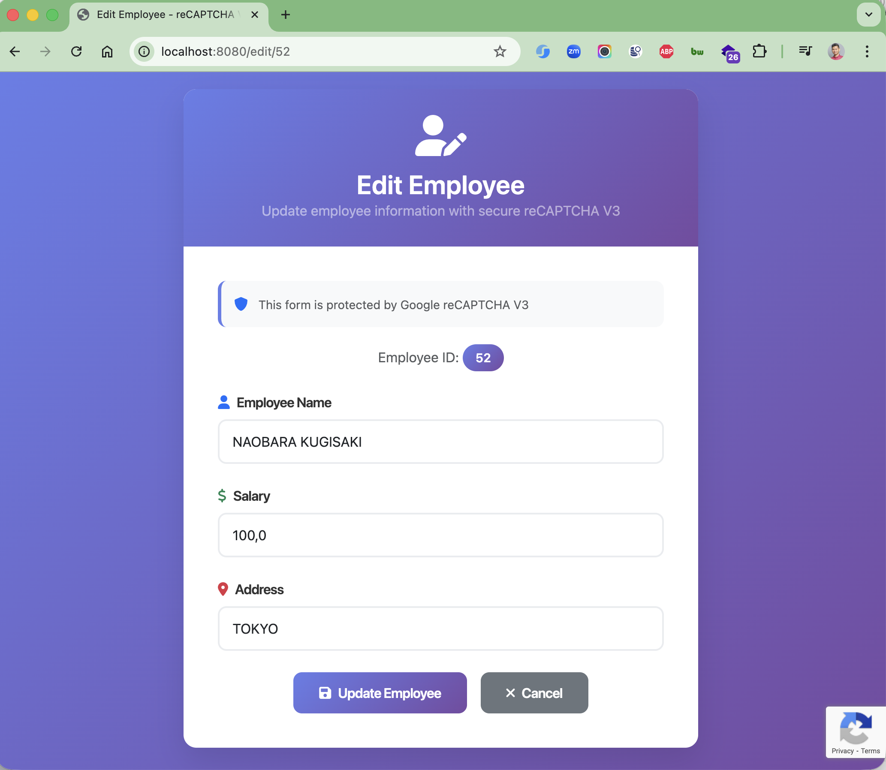
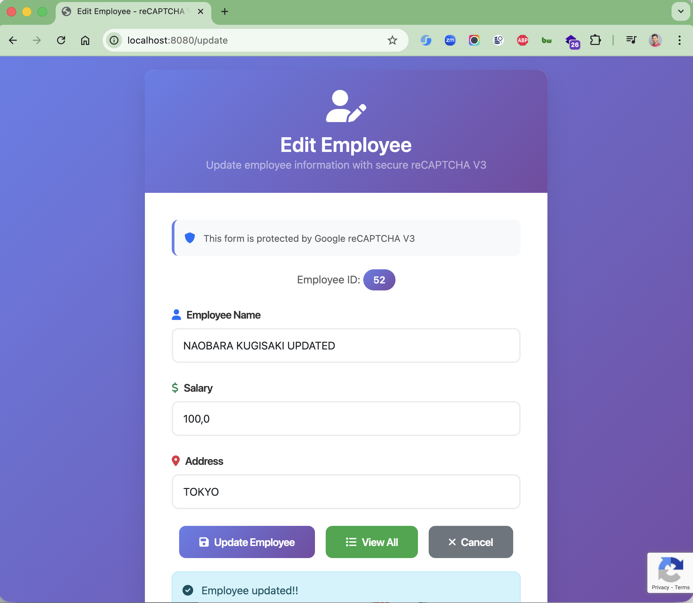
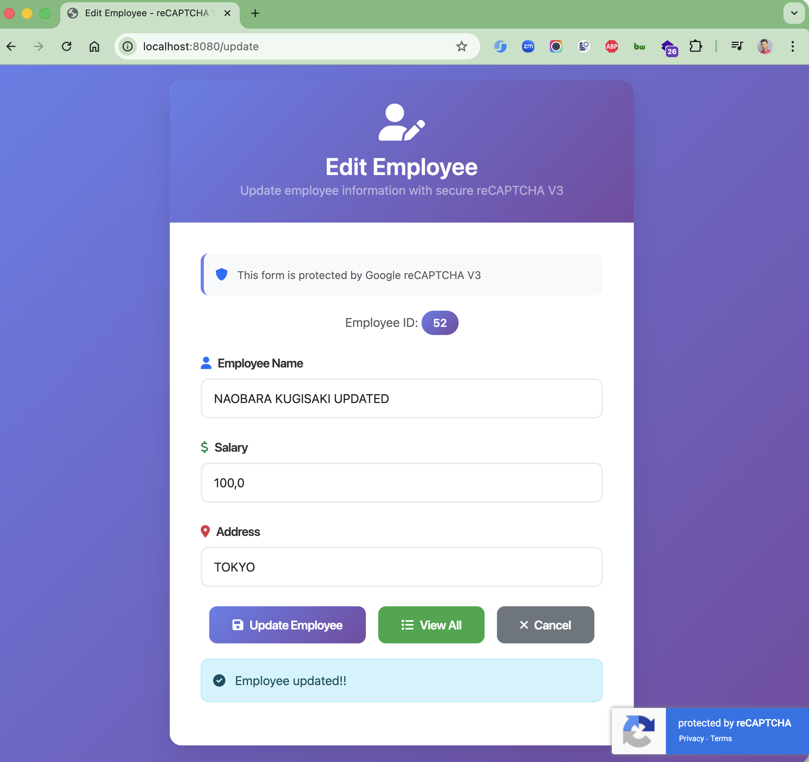
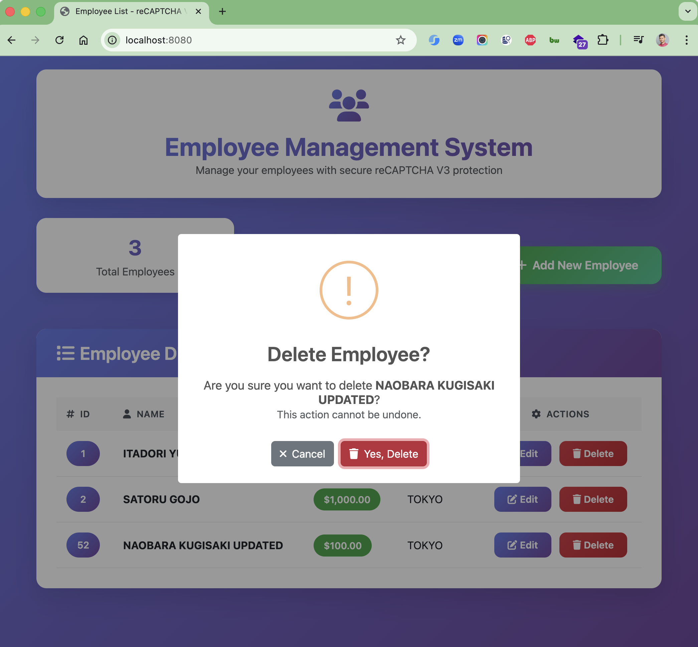

# Spring Boot reCAPTCHA V3 Integration

A Spring Boot application demonstrating the integration of Google reCAPTCHA V3 for secure form submissions with full
CRUD employee management functionality.

## Features

- **Google reCAPTCHA V3 Integration**: Seamless bot protection without user interaction
- **Full Employee CRUD Operations**: Create, Read, Update, and Delete employee records
- **Edit Functionality**: Update employee information with reCAPTCHA validation
- **Delete with Confirmation**: SweetAlert2 confirmation dialogs for safe deletions
- **Responsive UI**: Modern Bootstrap-based interface with smooth animations
- **Environment Variables**: Secure configuration with .env file support
- **MySQL Database**: Persistent data storage with JPA/Hibernate
- **Docker Compose**: Easy database setup and management
- **Comprehensive Logging**: Debug information for reCAPTCHA validation

## Tech Stack

- **Backend**: Spring Boot 3.5.6, Spring Data JPA, Thymeleaf
- **Database**: MySQL 9.4.0
- **Frontend**: Bootstrap 5.3.0, Font Awesome 6.0.0, SweetAlert2, JavaScript
- **Security**: Google reCAPTCHA V3
- **Build Tool**: Maven
- **Containerization**: Docker Compose
- **Environment Management**: spring-dotenv

## Prerequisites

- Java 17 or higher
- Maven 3.6+
- Docker and Docker Compose
- Google reCAPTCHA V3 Site Key and Secret Key

## Setup Instructions

### 1. Get reCAPTCHA Keys

1. Visit [Google reCAPTCHA Admin Console](https://www.google.com/recaptcha/admin)
2. Create a new site with reCAPTCHA v3
3. Note down your Site Key and Secret Key

### 2. Configure Application

Create a `.env` file in the project root:

```env
# Google reCAPTCHA v3 Configuration
GOOGLE_RECAPTCHA_SITE_KEY=YOUR_SITE_KEY_HERE
GOOGLE_RECAPTCHA_SECRET_KEY=YOUR_SECRET_KEY_HERE
```

The application.properties file references these environment variables:

```properties
# Google reCAPTCHA v3 Configuration
google.recaptcha.site.key=${GOOGLE_RECAPTCHA_SITE_KEY}
google.recaptcha.secret.key=${GOOGLE_RECAPTCHA_SECRET_KEY}
google.recaptcha.verify.url=https://www.google.com/recaptcha/api/siteverify
```

**Note:** A `.env.example` file is provided as a template.

### 3. Start Database

```bash
docker-compose up -d
```

### 4. Run Application

```bash
./mvnw spring-boot:run
```

The application will be available at `http://localhost:8080`

## Application Structure

```
src/
├── main/
│   ├── java/id/my/hendisantika/recaptchav3/
│   │   ├── config/
│   │   │   └── ReCaptchaConfig.java          # reCAPTCHA configuration
│   │   ├── controller/
│   │   │   └── EmployeeController.java       # Web controller
│   │   ├── dto/
│   │   │   └── ReCaptchResponseType.java     # reCAPTCHA response DTO
│   │   ├── entity/
│   │   │   └── Employee.java                 # Employee entity
│   │   ├── repository/
│   │   │   └── EmployeeRepository.java       # Data repository
│   │   ├── service/
│   │   │   └── ReCaptchaValidationService.java # reCAPTCHA validation
│   │   └── RecaptchaV3Application.java       # Main application
│   └── resources/
│       ├── templates/
│       │   ├── register.html                 # Registration form
│       │   ├── edit.html                     # Edit employee form
│       │   └── list.html                     # Employee list view
│       ├── application.properties            # Configuration
│       └── .env                              # Environment variables (not committed)
```

## API Endpoints

| Method | Endpoint       | Description                               |
|--------|----------------|-------------------------------------------|
| GET    | `/`            | List all employees                        |
| GET    | `/register`    | Show employee registration form           |
| POST   | `/save`        | Save employee with reCAPTCHA validation   |
| GET    | `/edit/{id}`   | Show edit form for employee               |
| POST   | `/update`      | Update employee with reCAPTCHA validation |
| GET    | `/delete/{id}` | Delete employee by ID                     |

## reCAPTCHA V3 Implementation

### Frontend (JavaScript)

- Automatically generates reCAPTCHA token on form submission
- Comprehensive validation and error handling
- Debug logging for troubleshooting

### Backend (Java)

- Validates reCAPTCHA token with Google API
- Configurable score threshold (currently 0.3)
- Detailed logging for debugging
- Graceful error handling

## Database Configuration

The application uses MySQL with the following default configuration:

```properties
spring.datasource.url=jdbc:mysql://localhost:3309/recaptcha_db
spring.datasource.username=yu71
spring.datasource.password=53cret
```

Database schema is auto-created via Hibernate DDL.

**Note:** The database port is `3309` to match the Docker Compose mapping.

## Testing

### Manual Testing Scripts

The project includes test scripts:

- `test_employee_add.sh` - Test employee addition
- `test_recaptcha_verification.sh` - Test reCAPTCHA verification
- `final_verification.sh` - Complete verification

### Running Tests

```bash
chmod +x test_employee_add.sh
./test_employee_add.sh
```

## Troubleshooting

### Common Issues

1. **reCAPTCHA Token is null**
    - Check browser console for JavaScript errors
    - Verify Site Key is correctly configured
    - Ensure reCAPTCHA script is loaded

2. **reCAPTCHA Validation Failed**
    - Verify Secret Key is correct
    - Check network connectivity to Google API
    - Review server logs for detailed error messages

3. **Database Connection Issues**
    - Ensure Docker containers are running
    - Check database credentials in application.properties
   - Verify port 3309 is not in use by other applications

4. **Environment Variables Not Loaded**
    - Ensure `.env` file exists in project root
    - Verify `spring-dotenv` dependency is included
    - Check that environment variable names match exactly

### Debug Logging

The application includes comprehensive debug logging:

```
DEBUG: Received reCAPTCHA token: [token]
DEBUG: Validating reCAPTCHA with Google...
DEBUG: reCAPTCHA Response - Success: true, Score: 0.9, Action: submit
```

## Screenshots

### Employee List


*Empty state with call-to-action to add first employee*


*Employee directory showing all records with Edit and Delete actions*


*Total employee count and management options*


*Complete employee list with action buttons*

### Add Employee


*Registration form with reCAPTCHA V3 protection*

### Edit Employee


*Edit form pre-filled with employee data*


*Success message after updating employee*


*Edit page with View All and Cancel buttons*

### Delete Employee


*SweetAlert2 confirmation dialog before deletion*

## Security Considerations

- reCAPTCHA V3 uses behavioral analysis instead of challenges
- Score threshold is configurable (currently set to 0.3 for better UX)
- All form submissions (add/edit) are validated server-side
- Environment variables stored in `.env` (excluded from git)
- Delete operations require user confirmation via SweetAlert2
- Thymeleaf security: Uses `data-*` attributes instead of inline event handlers

## Contributing

1. Fork the repository
2. Create a feature branch
3. Commit your changes
4. Push to the branch
5. Create a Pull Request

## License

This project is open source and available under the [MIT License](LICENSE).

## Author

**Hendi Santika**

- Email: hendisantika@gmail.com
- Telegram: @hendisantika34
- GitHub: [hendisantika](https://github.com/hendisantika)

---

*Built with ❤️ using Spring Boot and Google reCAPTCHA V3*